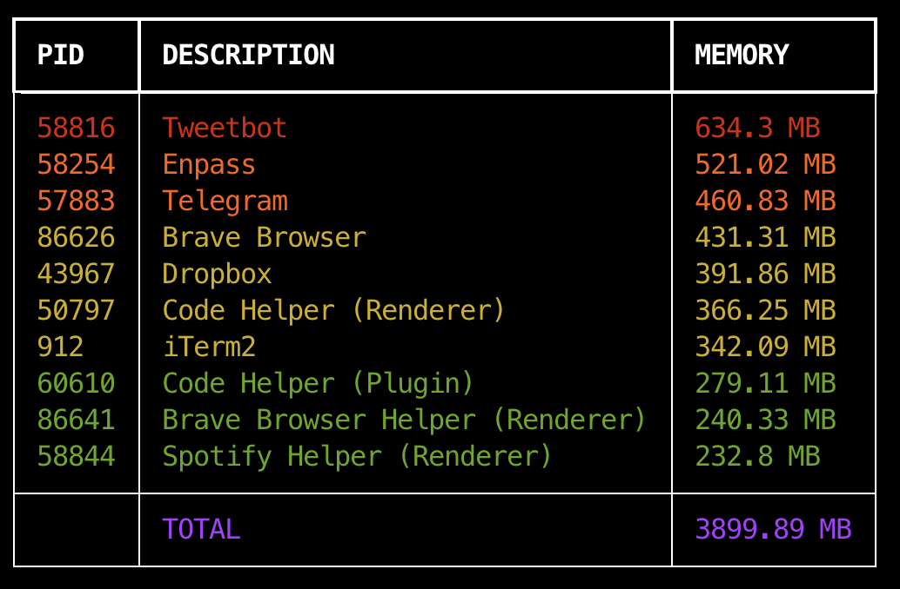

# memproc

✨ Fancy display of memory usage.

## Aim

This tool lets you show all processes in your system (like `ps aux`) including memory usage with a fancy display and a bunch of command line options. [RSS](https://en.wikipedia.org/wiki/Resident_set_size) is the chosen memory metric.



## Installation

```console
$ pip install memproc
```

## Usage

```console
Usage: memproc [OPTIONS]

╭─ Options ──────────────────────────────────────────────────────────────────────────────────────────────────────────────────────────────────╮
│ --version                            Show installed version.                                                                               │
│ --update                             Update memproc to last version.                                                                       │
│ --sort              -s      TEXT     Sort results by criteria (m:mem, p:pid, d:description). [default: m]                                  │
│ --sort-reverse      -r               Sort reverse by current criteria.                                                                     │
│ --description       -d      TEXT     Process description (n:name, e:executable, c:command line). [default: n]                              │
│ --show-total        -t               Show total used memory.                                                                               │
│ --units             -u      TEXT     Memory units (k:KB, m:MB, g:GB). [default: m]                                                         │
│ --num-processes     -n      INTEGER  Limit the number of processes shown. [default: 0]                                                     │
│ --grouped                            Group process by description.                                                                         │
│ --greater-than      -g      FLOAT    Show processes with used memory greater than this value. [default: 0]                                 │
│ --lower-than        -l      FLOAT    Show processes with used memory lower than this value. [default: 17179869184]                         │
│ --find-description  -f      TEXT     Find processes with text by the chosen description criteria.                                          │
│ --no-color                           Disable output coloring.                                                                                    │
│ --help                               Show this message and exit.                                                                           │
╰────────────────────────────────────────────────────────────────────────────────────────────────────────────────────────────────────────────╯
```

### Get version

```console
$ memproc --version
```

### Update tool

```console
$ memproc --update
```

### Use cases

Show all processes with the total amount of used memory:

```console
$ memproc -t
```

Sort results by pid with processes greater than 10MB and less than 100MB:

```console
$ memproc -sp -g10 -l100 -um
```

Show grouped Firefox processes sorted by command line:

```console
$ memproc --grouped -f firefox -sd -dc
```

Show the top 20 most memory consuming processes with KB units:

```console
$ memproc -n20 -uk
```

Show processes (sorted reverse memory used) with executable as description and GB units:

```console
$ memproc -de -ug -r
```

### Color

By default, processes are classified in 4 groups with regards to the maximum amount of memory usage. Each group is shown with colors: green, yellow, orange and red.

Output coloring can be disabled as follows:

```console
$ memproc --no-color
```

### Pager

You can use `memproc` with your favourite pager:

```console
$ memproc | less
```
